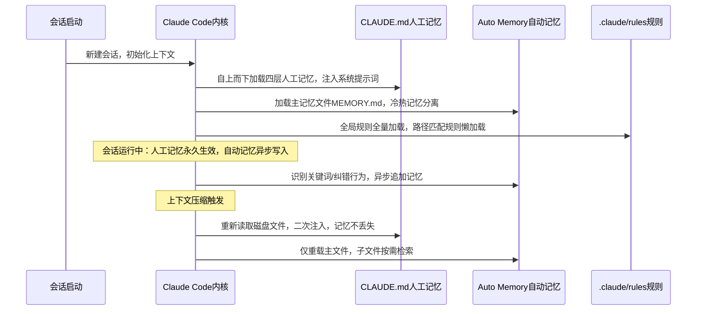

## 一、前言：所有LLM Agent共同的原罪——无状态短时记忆

### 1.1 原生Claude会话的致命缺陷

所有基础大模型的上下文窗口均为**短期工作记忆**，等价于计算机RAM内存：仅存活于当前会话进程，终端关闭、会话刷新、上下文压缩后，内存数据直接清空，无任何持久化落盘逻辑。

落地到AI编码协作场景，会产生两类无法规避的效率损耗：

1. **个人重复沟通成本**：每次新开会话，需要重复告知项目TS严格模式、目录读写限制、打包命令等固定规范，重复性指令占用大量token与沟通时间；

2. **团队协作信息断层**：单人会话内的规范调教无法同步团队，新人接入、同事接手会话后，需要从零重新对齐项目编码规范，团队知识库无法沉淀至AI助手。

### 1.2 行业主流记忆方案对比前置认知

目前行业Agent持久记忆分为三类设计范式：

- **纯人工管控**：GPTs自定义指令，所有记忆需要人工手动维护，模型无自主记忆能力；

- **纯模型自主记忆**：MemGPT，模型全权接管记忆写入、删除、压缩，人工无法精准干预，记忆噪音不可控；

- **人机协同记忆**：Claude Memory，人工管控核心团队规范，模型自主沉淀个人细碎经验，各司其职，也是目前工程落地最优解。

---

## 二、/memory命令：Claude记忆系统的统一管控入口

### 2.1 核心定位

`/memory`是Claude Code内置原生管控命令，是用户查看、编辑、开关、管理全部持久化记忆文件的唯一入口，核心回答一个核心问题：**当前Claude会话已经永久记住了哪些信息**。

### 2.2 执行后展示的三类记忆载体

在Claude Code交互终端输入`/memory`，会直接罗列当前会话已加载的全部记忆资源，分为三类：

1. **人工静态记忆文件**：多层级CLAUDE.md系列人工指令文件；

2. **模型自动记忆文件**：Auto Memory自主生成的笔记、纠错记录、项目经验；

3. **模块化规则文件**：.claude/rules目录下按需加载的分域编码规则。

同时支持可视化开关Auto Memory自动记忆能力、一键打开本地记忆文件夹直接编辑底层记忆源文件，无需手动查找系统隐藏目录。

---

## 三、核心架构深挖：双记忆引擎互补设计（全文核心）

Claude Memory没有采用单一记忆存储方案，而是拆分**人类主导的确定性记忆**与**模型主导的不确定性记忆**，双引擎并行运行，完全贴合人脑记忆逻辑：大脑长期固定认知（人工写入）+ 日常经验自主复盘（模型自动记录）。

### 3.1 整体架构流程图


### 3.2 双记忆系统核心维度横向对比

|对比维度|CLAUDE.md（人工可控记忆）|Auto Memory（模型自动记忆）|
|---|---|---|
|记忆写入方|开发者手动编写，100%可控|Claude大模型自主识别写入，无需人工干预|
|存储路径|项目目录/系统根目录，跟随代码仓库|系统隐藏目录 ~/.claude/projects/，本地私有|
|Git版本管控|支持提交，团队全员共享同步|禁止提交，仅个人本地私有|
|加载时机|会话启动+上下文压缩后双重重载|会话启动加载主文件，子文件按需懒加载|
|适用存储内容|团队强制规范、项目架构、编码硬性要求|个人编码偏好、历史纠错记录、项目踩坑经验|
|记忆确定性|100%强制遵守，无偏差|模型自主判断，存在少量记忆噪音|
---

## 四、人工记忆CLAUDE.md：四层分层加载底层原理（硬核深挖）

很多开发者误以为CLAUDE.md只是单个配置文件，实际上它是**全域四层递进式记忆体系**，遵循「全局通用→项目专属→个人私有→模块化细分」的加载逻辑，同时拥有上下文压缩后自动重载的独有底层能力，彻底解决大模型上下文压缩丢失关键指令的行业通病。

### 4.1 四层记忆层级与作用边界

1. **层级1：全局公共记忆 ~/.claude/CLAUDE.md**

    - 生效范围：本机所有Claude Code项目，全局统一偏好；

    - 适用内容：回复语言、通用编码风格、全局提交规范；

2. **层级2：项目公共记忆 ./CLAUDE.md**

    - 生效范围：当前代码仓库，跟随Git同步；

    - 适用内容：项目技术栈、目录约束、团队硬性编码规范；

    - 工程价值：新人拉取代码即可自动对齐团队规范，零培训成本。

3. **层级3：个人本地私有记忆 ./CLAUDE.local.md**

    - 默认加入.gitignore，不纳入版本管理；

    - 生效范围：当前项目仅本机生效；

    - 适用内容：个人调试习惯、私有测试配置，不干扰团队协作。

4. **层级4：模块化规则记忆 .claude/rules/*.md**

    - 支持glob路径匹配条件加载，是大型项目核心能力；

    - 区分全局无路径规则、文件路径绑定规则，精准节约上下文token。

### 4.2 底层加载时序核心细节（官方未公开底层逻辑）

1. Claude Code启动后，从当前工作目录**向上递归遍历至系统根目录**，逐级加载所有CLAUDE.md文件，子目录配置自动覆盖上级目录冲突规则；

2. **关键底层优化**：当会话上下文触发自动压缩（大模型常规上下文瘦身机制），普通会话内指令会直接丢失，但CLAUDE.md会**重新从磁盘读取并注入系统提示词**，永久保证核心规范不丢失；

3. 优先级规则：下级目录规则 > 上级目录规则，个人本地规则 > 项目公共规则。

---

## 五、自动记忆Auto Memory：模型自主记忆全链路拆解

Auto Memory是Claude纯自主运行的黑盒记忆模块，无需人工编写任何规则，核心定位是**沉淀非标准化、碎片化的个人协作经验**，采用冷热记忆分层存储架构，最大化节省上下文窗口token。

### 5.1 自动记忆触发四大场景

模型内置分类识别器，命中以下场景会异步落盘记忆，不占用当前对话推理耗时：

- 人工纠错行为：开发者纠正模型错误写法、错误逻辑；

- 显性记忆指令：识别「记住/别忘了/remember」等关键词，强制写入记忆；

- 重复交互模式：多次重复同类纠正，模型自动归纳通用规则；

- 项目核心元信息：构建命令、目录结构、接口范式等固定项目信息。

### 5.2 冷热记忆分层存储设计（核心性能优化点）

```plaintext
~/.claude/projects/项目唯一标识/memory/
├── MEMORY.md          # 热记忆：会话启动强制加载至上下文，核心高频记忆
├── debugging.md        # 冷记忆：调试踩坑记录，需要时按需读取
├── patterns.md         # 冷记忆：代码通用模式，懒加载
└── api-conventions.md # 冷记忆：接口规范，按需检索

```

**底层设计亮点**：仅主文件MEMORY.md常驻上下文，细分主题冷记忆文件全部懒加载，既保证高频记忆实时生效，又避免海量历史记忆占满上下文窗口，完美平衡记忆完整性与推理速度。

### 5.3 200行记忆阈值底层原理解析

官方建议MEMORY.md与CLAUDE.md主文件控制在200行以内，并非产品限制，而是**大模型注意力机制固有特性**：当提示词内规则文本超过200行，模型注意力分片会分散，低优先级规则遵守率断崖式下跌。超长规则必须拆分至rules模块化文件，这是工程落地不可违背的硬性准则。

---

## 六、高阶能力：.claude/rules路径条件化模块化规则

当项目规模扩大，单CLAUDE.md会出现规则臃肿、上下文冗余问题，模块化规则引擎解决大型Monorepo项目分域规范管理难题，其核心杀手锏为**glob路径匹配按需加载**。

### 6.1 规则文件基础结构（带前置元数据）

```markdown
---
paths:
  - src/api/**/*.ts # glob匹配规则，仅编辑该目录文件时加载
---
## 后端API强制规范
- 所有接口必须增加入参Schema校验
- 统一错误码枚举返回
- 响应体固定 {code,data,message}

```

### 6.2 两类规则加载逻辑

1. **无paths全局规则**：会话启动全量注入上下文，适用于全项目通用安全规范、代码基础风格；

2. **带paths域内规则**：懒加载机制，仅当编辑匹配路径文件时，才临时注入对应规则，前端规则不会污染后端编码上下文，极致节省token。

### 6.3 Monorepo项目最佳目录结构

```plaintext
.claude/
  rules/
    frontend/    # 前端专属规则
    backend/     # 后端专属规则
    general/     # 全局通用规则

```