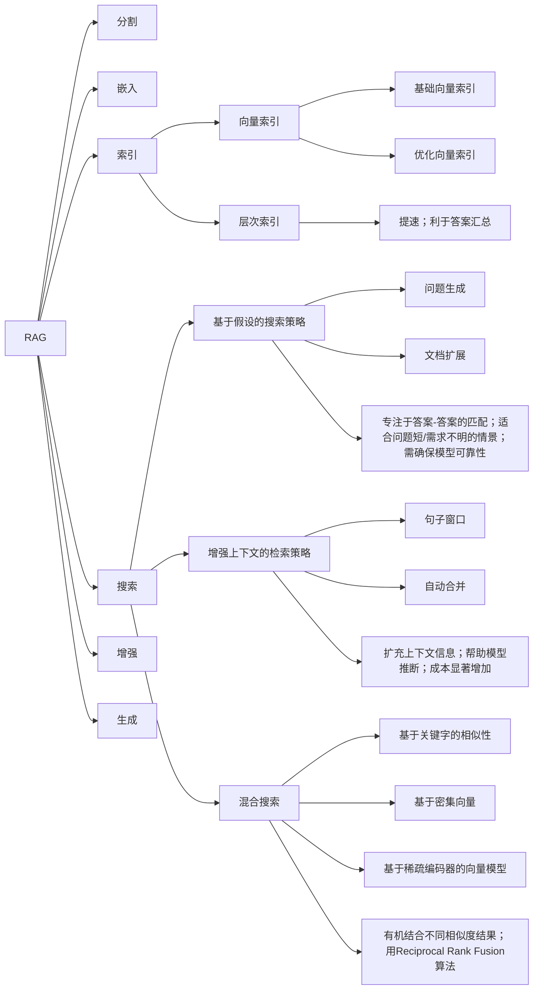
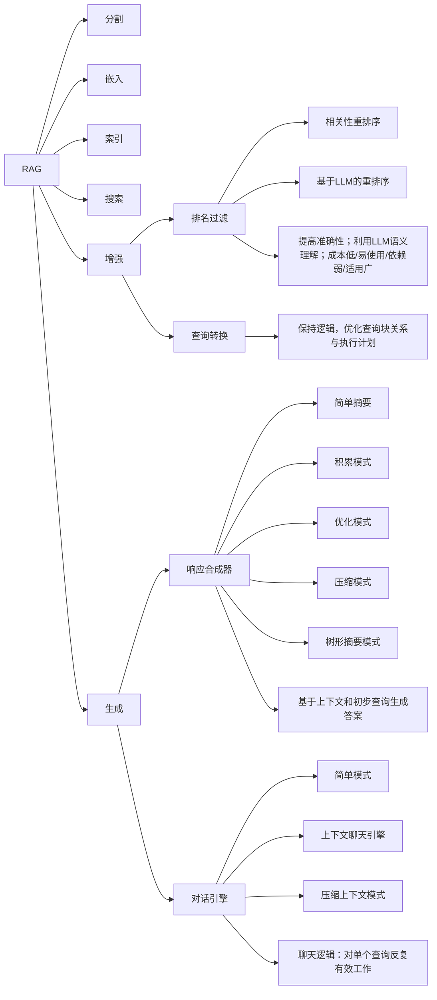

# RAG
### 产生
- 知识密集型任务
指如果不依靠外部知识，即使是人类也不能取得很好的表现的任务
① 模型容量再大，也记不住所有知识。
② 难以方便地扩展或修改全部知识

## 检索增强生成 （Retrieval Augmented Generation）

- 思路：根据收到的问题从外挂的知识库检索相关上下文背景提供准确和最新的知识。
	- 阶段① 合了序列到序列（Seq2Seq）模型和生成对抗网络（GAN）的思想，利用向量数据库的高效存储和检索能力，在检索阶段召回目标知识
	- 阶段② 利用大模型/提示词工程实现增强，将召回的知识合理利用，生成目标答案

- 目的：
	- ①提高质量（允许对新增数据使用相同的模型处理无需调整和微调模型，拓展可用性）
	- ②减少错误（降低幻觉的可能）
	- ③保证私域数据安全（本地知识库）
		实现 ==“开卷”答题==
相当于为参数化的seq2seq模型赋予了检索式的非参数记忆，实现拿到问题后先查资料再答题的效果
 
### 模型工作流程
以LangChain为例：
- 1. 文档加载与处理
加载文档（Local Documents）：从本地文档中获取原始数据。

文档预处理（Unstructured Loader）：解析文档并转换为文本格式。

文本处理（Text）：存储解析后的文本。

文本分块（Text Splitter）：将大文本分割为小的文本片段（Chunks）。

- 2. 索引构建
文本嵌入（Embedding）：使用嵌入模型将文本块转换为向量表示。

存储向量（VectorStore）：存储文本块的向量表示，以便快速检索。

- 3. 查询处理
用户查询（Query）：用户输入查询。

查询嵌入（Embedding）：将查询转换为向量表示。

生成查询向量（Query Vector）。

- 4. 检索相关文本
计算相似度（Vector Similarity）：计算查询向量与存储向量的相似度。

检索相关文本（Related Text Chunks）：根据相似度找到最相关的文本片段。

- 5. 生成回答
填充提示模板（Prompt Template）：将检索到的文本填充到提示模板中。

构造最终Prompt（Prompt）。

输入LLM（LLM）：将最终Prompt输入大语言模型。

生成答案（Answer）：大语言模型基于检索的文本和用户查询生成最终答案。

### 主要组成部分

- 检索器（Retriever）：检索器从大规模语料库中检索与给定目标文本相关的上下文，并使用这些上下文来增强生成器的输入。检索器通常使用预训练的语言模型进行查询和匹配操作。
- 生成器（Generator）：生成器使用检索器检索到的上下文和目标文本作为输入，并生成与目标文本相关的响应或文本。生成器通常采用Seq2Seq模型结构，将上下文和目标文本拼接在一起作为输入，并输出生成的响应文本。
- 判别器（Discriminator）：判别器的目的是区分生成的文本和真实的语料库文本。它使用深度学习技术，如卷积神经网络（CNN）或循环神经网络（RNN），来对生成的文本进行分类和打分，以评估其真实性和质量。

### 各模块的思路与实现方法
### 1 文档解析器-把非结构化的文档转换为结构化的数据
- **文档类型**
  - 基于标记语言的文档（markdown,html,latex）
  - 半结构化文档（word等）
  - 低结构化文档（ppt,pdf）
- **OCR基础开源方案**
  - 文字：Paddle-OCR,Rapid-OCR,……
  - 表格：Camelot, Paddle-OCR, 阿里透光，line-less table-Transformer (TATR)
  - 公式：Nougat, marker
- **难点**
  - 文字：多语言；换行符
  - 公式：中文开源方案较少；
  - 表格：跨页表格识别不全；复杂表格效果差；
  - 图片：位置标记和召回

### 2 文本分割器-把结构化的文档分割为固定大小的文本块
- **文本分割器**
  1. 基于规则的分割
     - RecursiveCharacterTextSplitter
     - TextSplitter
     - CharacterTextSplitter
  2. 基于模型的分割
     - damo/nlp_bert_document-segmentation_chinese-base
     - NLTKTextSplitter  tikitoken
     - SpacyTextSplitter  tikitoken
  3. 针对高度结构化的非结构文本的分割器
     - MarkdownTextSplitter，PythonCodeTextSplitter，HTMLHeaderTextSplitter,LaTeXTextSplitter
  4. 面向token的分割
     - SentenceTransformersTokenTextSplitter

### 文本分割中的难点
非模型分割器的chunk_size和overlapping的权衡
- chunk_size控制每个文本块的大小，overlapping控制相邻文本块的重合字符。
- 较小的chunk_size可能会破坏语义的连贯性，较大的chunk_size可能会将不同语义的文本块合并；较大的overlapping会导致检索到的文本块重复率高，较小的overlapping会割裂文本间的语义联系。

### 3 Embedding模型-把文本转换为稠密向量

#### 模型信息表
| 模型       | 是否添加instruction | 训练数据模式 |
|------------|---------------------|--------------|
| Sentence-T5 | 否                  | 对称         |
| GTR        | 否                  | 非对称       |
| Stella-v2  | 否                  | 非对称       |
| piccolo    | 否                  | 非对称       |
| Instructor | 是                  | 混合         |
| m3e        | 否                  | 混合         |
| bge        | 是                  | 混合         |
| gte        | 否                  | 混合         |

#### 各类型模型说明
- **对称（query/question_text）**
  - Sentence-T5：T5-encoder+mean pooling；无标注对比学习+有标注对比学习的两阶段训练

- **非对称（query/text）**
  - GTR：与sentence-T5结构相同；从M1域检索hard negative数据（结合rocketqa）；双向对比学习（双损失）；无instruction的非对称训练
  - Stella-v2：带hard negative的对比学习训练；地址：`https://huggingface.co/infgrad/stella-large-zh-v2`；无instruction的非对称训练
  - piccolo：无监督二元组预训练+hard negative三元组精调；地址：`https://huggingface.co/sensenova/piccolo-base-zh`；无instruction的非对称训练

- **混合**
  - Instructor：以GTR为基底+instruction tuning；输入格式为「base instruction+[doc]」；无instruction的混合训练
  - m3e：补充对比训练（含大规模对称/非对称数据）；地址：`https://github.com/wangyuxinwhy/uniem`；非对称预训练+对称/非对称监督训练
  - gte：无instruction的混合训练；地址：`https://huggingface.co/thenlper/gte-large-zh`
  - bge：可instruction的混合训练；RetroMAE预训练+对比训练精调；地址：`https://github.com/FlagOpen/FlagEmbedding`

### RAG流程（1）：分割→嵌入→索引→搜索→增强→生成

### RAG流程（2）：分割→嵌入→索引→搜索→增强→生成

